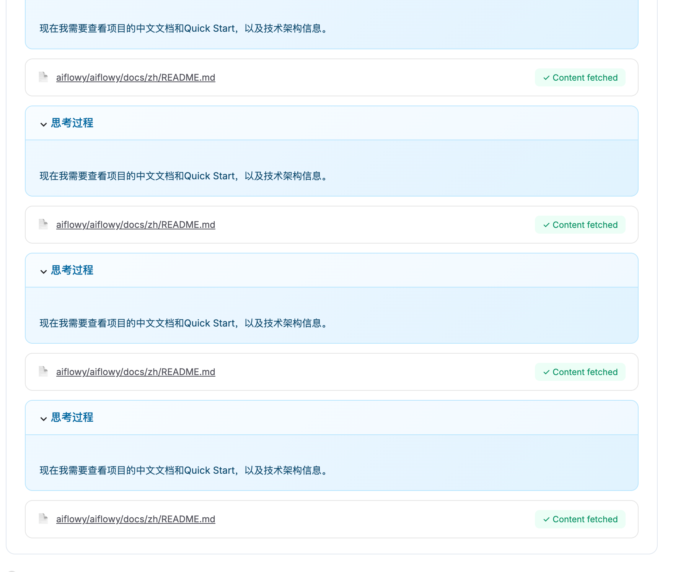
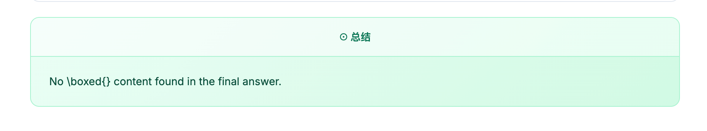

1. 重复无效操作。

- 先解决为什么会有这个问题，解决它。

- 后续防御性（【暂时不做，不管这一项】）：如果同一个环节（而不是同一个文件）一直没有给出有效的继续往下的信息，一直在那里打转，比如思考过程是“现在我需要查看项目的最新提交和Release版本，以及Issues和PR的情况。首先查看Issues列表，了解维护规范和社区互动情况。”，然后操作上也只是一直在那里fetch不同链接（纯瞎猜的链接）content。那么，直接切换另一个模型（kimi-k2-thinking，就是我配置了的那个模型）来这一环节思考，使得整个流程能够往下继续走，而不是卡在那里。然后切换完继续往下走了之后，立马再切换回 mirothinker-v1.5-30B 模型。

其实核心问题是，为什么现在是直接 fetch 瞎猜文件链接，而不是先罗列文件呢？我怀疑就是因为模型思考能力出问题，所以才用这样的切换模型来思考的解决方式，但如果能直接解决这问题，应该会更简单。你给我合适的解决方式。

2. 最终总结没东西。解决这个问题

3、现在分析一个项目是挺不错的了，但这工具不应该只能做这事情。需要结合这项目（当前开启的 github only）实际能力，给一些更合适的场景（目前 product-readme.md 写得不好）

4、因为一共就 max turns 轮，那整体应该动态规划好，最终需要收敛的啊，至少需要把整个任务框架给跑完而不是中间过程中就一直在做一些意义不大的轮次，就是主次需要安排规划好。

